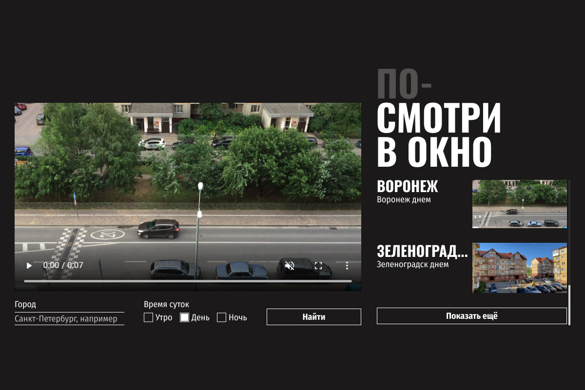

git@github.com:OlegKashkov/posmotri-v-okno-fd.git

# Проект "Посмотри В Окно"

## Содержание:

1. [Дизайн проекта](#дизайн-проекта)
2. [Описание](#описание)
3. [Отличие от 1 проекта](#в-чем-отличие-данной-работы-от-1-проекта)
4. [Автор](#автор)

### Дизайн проекта

### Описание

Данное приложение позволяет "выглянуть" из окон самых разных городов мира.

### В чем отличие данной работы от 1 проекта
Главное отличие проекта "Посмотри в окно" от проекта "Оно тебе надо" в том, что в этом проекте была проведена работа над чужим кодом. А первый проект создавался с нуля.

## Автор

- Github - [Oleg Kashkov](https://github.com/OlegKashkov)